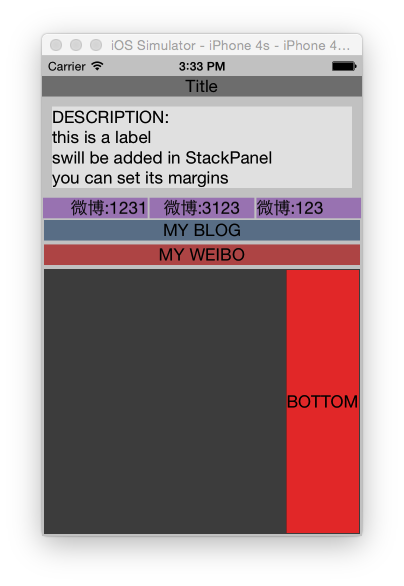

## LayoutPanel
LayoutPanel 是一个 view 排布器, 你可以随意的将你的 view 添加到里面, 然后指定排布器如何对添加的 view 进行排布.
使用排布器将使你从繁琐的 view 位置计算中解放出来, 使你只要通过指定一个排布方式,就可以对一个或更多的 view 进行定位.

[介绍博客 link](http://nekle.github.io/2013/10/23/iOS%E8%87%AA%E5%8A%A8%E6%8E%92%E5%B8%83%E5%99%A8--LayoutPanel.html)

## demo

**iPhone6**

**iPhone4s**

